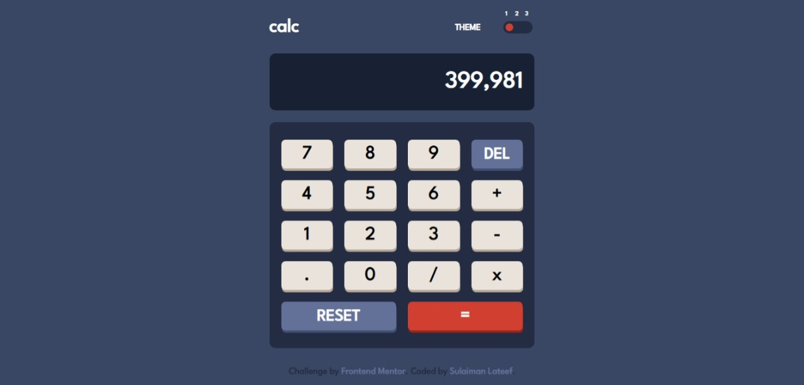

# Frontend Mentor - Calculator app solution

This is a solution to the [Calculator app challenge on Frontend Mentor](https://www.frontendmentor.io/challenges/calculator-app-9lteq5N29). Frontend Mentor challenges help you improve your coding skills by building realistic projects. 

## Overview

### Screenshot

### Links

- Solution URL: (https://your-solution-url.com)
- Live Site URL: (https://your-live-site-url.com)

### Built with

- Semantic HTML5 markup
- CSS custom properties
- Flexbox
- CSS Grid
- Desktop-first workflow
- JavaScript

## Author

- Frontend Mentor - [@El-Dev](https://www.frontendmentor.io/profile/El-Dev)
- Twitter - [@sulaymanlateef](https://www.twitter.com/sulaymanlateef)
